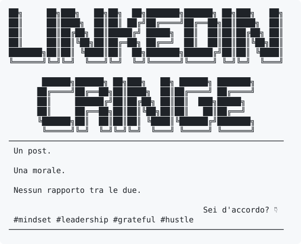
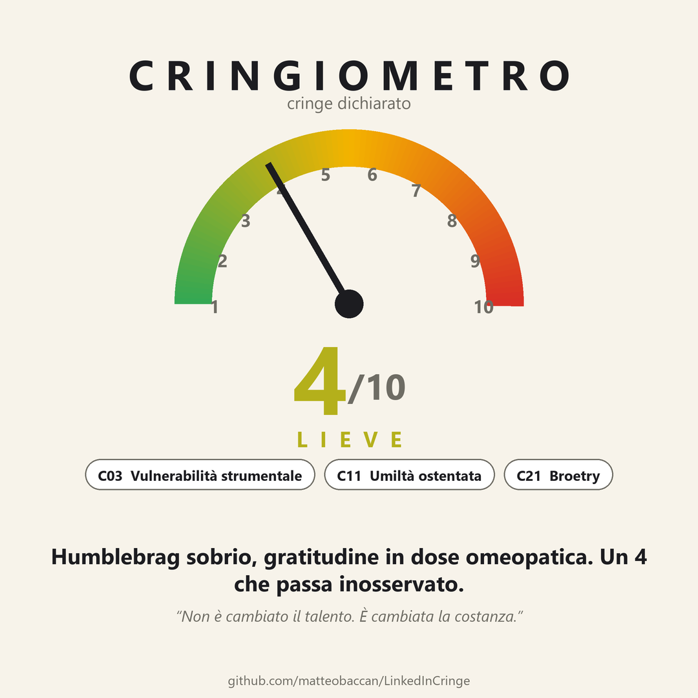
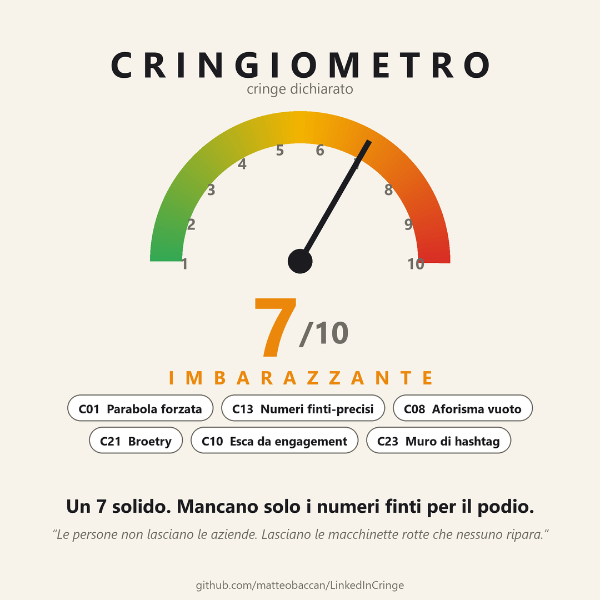
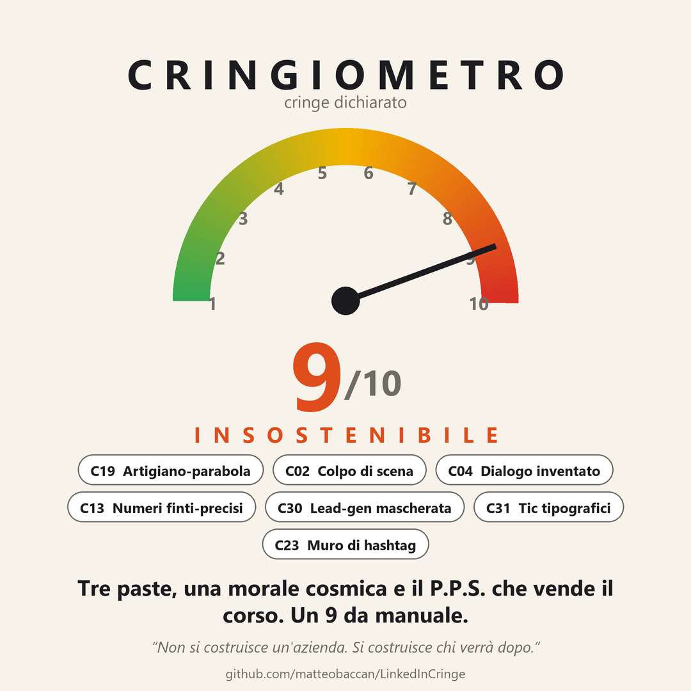
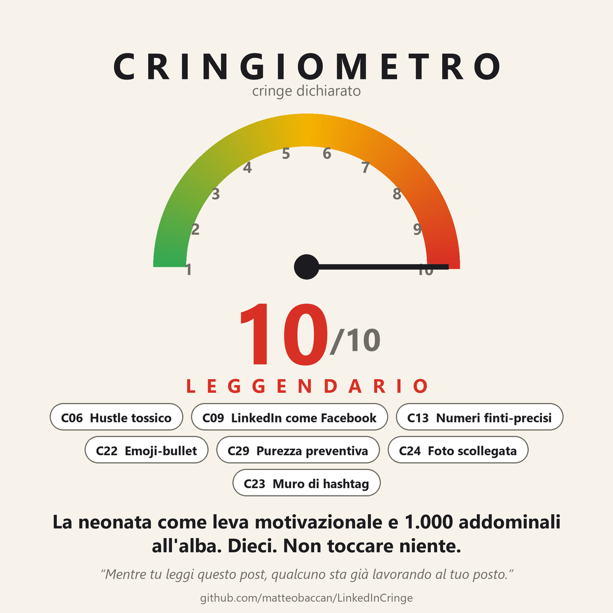
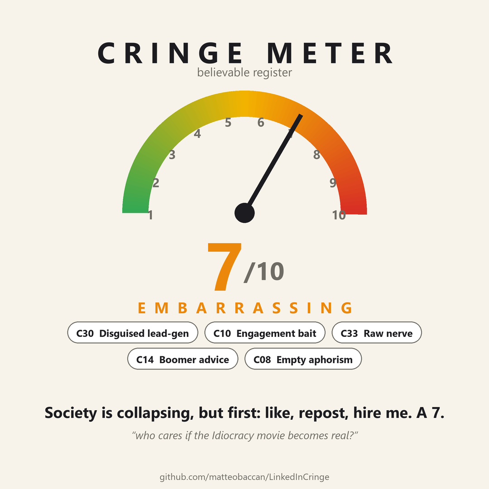
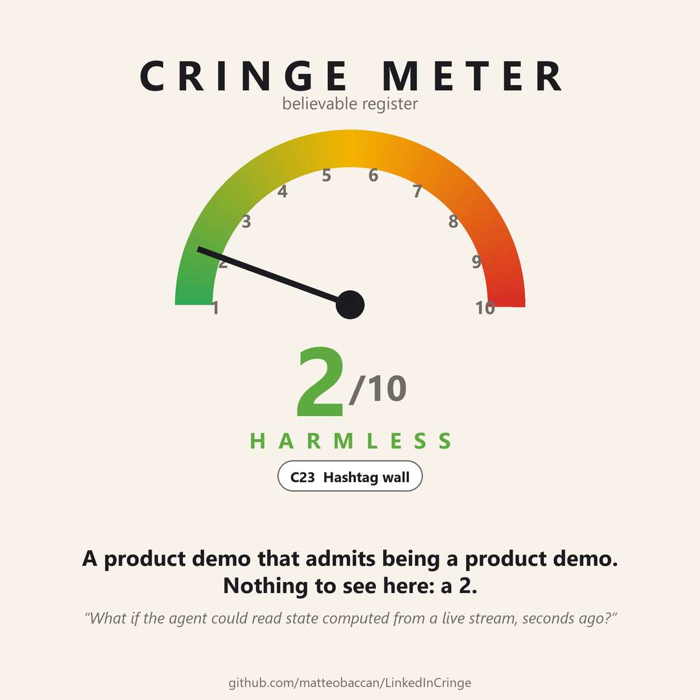

🇮🇹 [Versione italiana](README.md) — the full README; this is the short tour.

# LinkedIn Cringe

Three skills for Claude Code that close the loop:

- **`linkedin-cringe`** generates cringe LinkedIn posts — the real kind, the
  kind that gets screenshotted and passed around in group chats;
- **`linkedin-cringe-analytics`** scrapes the comments once the post is
  published and measures what happened: how many believed it, how many got
  the joke, the top ten comments by reactions, the tones, the involuntary
  cringe of the comments themselves;
- **`linkedin-cringe-meter`**, the *Cringiometro*, rates somebody else's post
  with the same yardstick: a 1-10 score, the modules it hits, a one-line
  verdict, and an anonymous image ready to drop in the comments.

What the other two discover feeds back into the first: the catalog improves
with real data, not opinions.

The generator doesn't produce "bad posts". It produces **vicarious
embarrassment**: posts whose author truly believes them, claims a depth the
text doesn't have, and is selling something while pretending to sell nothing.

## Generation

Invoked bare, the skill asks four questions: **cringe level** (4 mild ·
7 embarrassing · 9 unbearable · 10 legendary), **credibility** (believable
vs. declared parody), **voice** (hustle guru, founder/CEO, HR/recruiter,
boomer with advice), and which of the **36 cringe modules** (`C01`…`C36`)
to build on — forced parables, moralistic plot twists, strategic
vulnerability, toxic hustle, fake-precise numbers, broetry, planted logical
errors, hour-by-hour diaries, out-of-scale statistics, and more. Spell
everything out in the request and it skips the questions.

Posts can also start from a **real fact**: a good share of real-world cringe
is a piece of news with a business lesson glued on top. Hand the skill a
news item, a figure or a link and it keeps dates and numbers exact; say
"inspired by current events" and it searches the last few days' news,
proposes 3-4 hooks and writes on the one you pick. The fact stays true and
unlinked in the body, the moral stays unrelated, and the closing line
separates the true part from the fake one. Tragic news is used only in
parody mode; in believable mode it is dropped or softened to aggregate data.
See
[`references/attualita.md`](.claude/skills/linkedin-cringe/references/attualita.md).

Italian is the default, but cringe is not an Italian phenomenon: ask for
another language and the skill **regenerates from the modules** instead of
translating (a translated post sounds translated, and stops being
believable). The jargon layer, hashtags and culture-bound modules are
rebuilt on the local job market.

Every generated post ends, after the hashtags, with one line revealing the
joke. Field-tested finding: the hashtag wall genuinely buries it — on one
viral post, a third of commenters believed the post anyway.

The skill also bans AI flavor (em-dashes, polished connectives, perfect
triads, uniform paragraphs) and, at delivery, proposes a ready-to-use
image-generation prompt that won't get debunked by commenters zooming in.

> **Note.** No example in this repository transcribes or reworks a real
> post. Everything is written from scratch from the taxonomy and modules;
> names, companies, numbers and anecdotes are invented.

## Analytics

Give `linkedin-cringe-analytics` a LinkedIn post URL and you get a markdown
report: believers 😇 vs. in-on-the-joke 🎭 (with honest denominators), top
ten comments by reactions, recurring phenomena, tone distribution,
commenter-category × outcome cross-table, and a cringe-meter of the most
earnest comments. With the **Claude in Chrome** extension it collects the
comments by itself in your logged-in browser; without it, pasting the page
text is enough.

Two fixed rules: commenters are **always anonymized** in reports, and
coverage is always declared ("read X comments of a counter showing Y").

Field results so far, from two really-published posts: on a viral level-7
post about **36% of commenters believed it**; on a level-9 post caught early,
~86% got the joke. The difference isn't the text — it's the audience that
virality brings in.

## Cringe meter

Give `linkedin-cringe-meter` a LinkedIn post URL (short `lnkd.in` links work
too), or the pasted text, or a screenshot, and you get:

- the **1-10 level** on the generator's own scale (1-2 harmless, 3-4 mild,
  5-6 annoying, 7-8 embarrassing, 9 unbearable, 10 legendary), with the
  event → moral gap in one line;
- the **modules it hits**, each with the quote from the post that proves it;
- the **register** (believable, parody, or *declared cringe* when there is a
  disclaimer line), **AI flavor** (low/medium/high), **lead-gen** and where it
  hides;
- a one-line **verdict**, blastometer-style but about cringe;
- **what's missing to climb one level**, which is the bridge back to the
  generator;
- a markdown report in `analisi/` and a **1080×1080 image** ready to be left
  as a reply under the post.

With the **Claude in Chrome** extension it reads the post by itself in your
logged-in browser (post text only, no comments); without it, paste the text.
**The image speaks the language of the post**: title, register and scale word
are localized (Italian, English, German, French, Spanish, others via override)
and module names, verdict and quote are written in that language. The report
stays in yours.

### Gallery

The first four are invented posts from the generator's
[`references/esempi.md`](.claude/skills/linkedin-cringe/references/esempi.md)
(hence the "declared cringe" register); the last two are real English posts,
anonymized.

| | | |
|---|---|---|
|  |  |  |
| 4/10, the sober humblebrag | 7/10, the broken coffee machine | 9/10, the pastry shop and the P.P.S. |
|  |  |  |
| 10/10, 5:17 am and the newborn | 7/10, real post: society collapses, then "hire me" | 2/10, real post: a product demo that admits being one |

The last one is the control sample: an honest technical post must score low.
The meter tells cringe apart from declared marketing, from opinions you
disagree with, and from posts that are merely bad (that's a 2, not a 7).

### How it works

The score comes from the model reading the generator's `tassonomia.md` and
`moduli.md` through the rubric in
[`references/valutazione.md`](.claude/skills/linkedin-cringe-meter/references/valutazione.md):
gap first, then modules with evidence, then ±1 for register; a module without
a quote doesn't count. The image is drawn by
[`scripts/cringiometro.py`](.claude/skills/linkedin-cringe-meter/scripts/cringiometro.py)
(Python + Pillow, no browser) from a JSON with score, register, modules,
verdict, quote and language, so it can be tweaked and regenerated by hand;
without Pillow you get the SVG.

The image **never carries the author's name, photo or headline**: the post is
judged, not the person. Real grief, illness or layoffs are not rated. Leaving
the image under a stranger's post is your call: the skill hands over the file
and stops there.

## Installation

The skills live in `.claude/skills/` inside this repository, so **cloning
the repo installs them**: open Claude Code in the folder and they're
available.

```bash
git clone https://github.com/matteobaccan/LinkedInCringe.git
cd LinkedInCringe
```

To use them everywhere, copy the three folders under `~/.claude/skills/`
(details in the [Italian README](README.md#installazione)). The cringe meter
needs Pillow for the PNG (`pip install pillow`); without it you get the SVG.

## Usage

```
/linkedin-cringe
```

```
write me a level 8 cringe post, believable, recruiter voice, topic: job interviews
```

```
/linkedin-cringe-analytics https://www.linkedin.com/posts/...
```

```
/linkedin-cringe-meter https://lnkd.in/p/...
```

```
how cringe is this post? <pasted text>
```

## Guardrails

Even in "believable" mode the generator never produces posts attributed to
**real people** or signed by **existing companies**, never uses real grief,
illness or layoffs as material, and never imitates a specific profile to
pass it off as authentic. Names are always fictional: it's satire, not
impersonation. The analytics skill always anonymizes commenters, judges
comments and never people, and keeps raw data out of the repository. The
cringe meter never names the author of the rated post, judges the post and
not the person, and refuses to score real grief, illness or layoffs; leaving
the image under a stranger's post is the user's call, the skill just hands
over the file.

## Send us your cringe

The catalog improves with real data, and the real data is in your feed: the
hustle-guru post that made you close the app, the recruiter-philosopher, the
one *you* wrote in 2019 that still keeps you up at night. Open an
[issue](https://github.com/matteobaccan/LinkedInCringe/issues) with the text
(anonymized: no real names, no recognizable companies), tell us whether it
was found in the wild or self-produced, and — if you dare — guess its level
and modules. If it fits none of the 36, you may have just discovered `C37`.
Accepted submissions land in [`community/`](community/).

## Thanks

To [**Maicol Pirozzi**](https://youtube.com/playlist?list=PLCj24iwop8vijRvocuUO85rEqRU4-o2Mv)
and the [r/LinkedInCringeIT](https://www.reddit.com/r/LinkedInCringeIT/)
community, for the endless inspiration.

## License

MIT.
